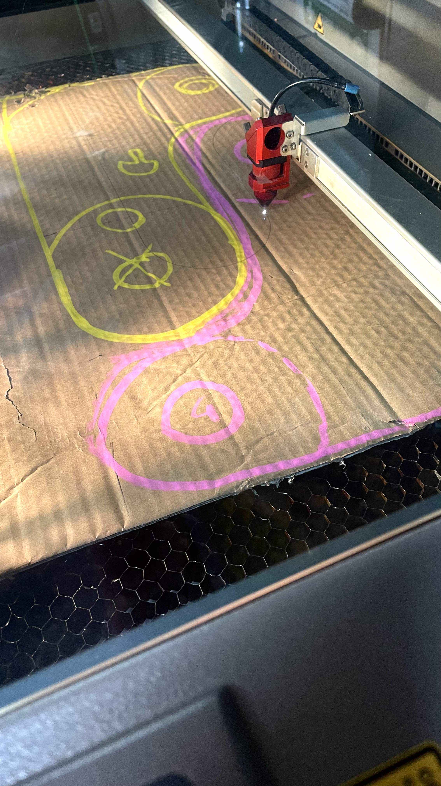
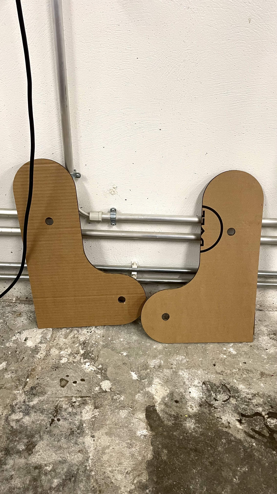
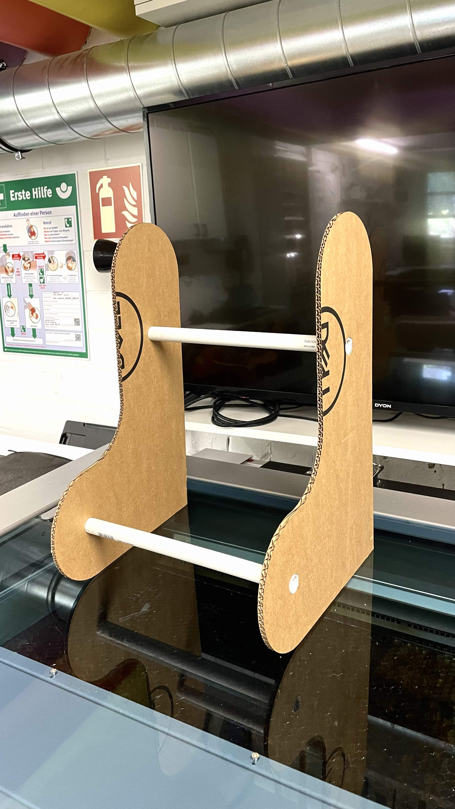
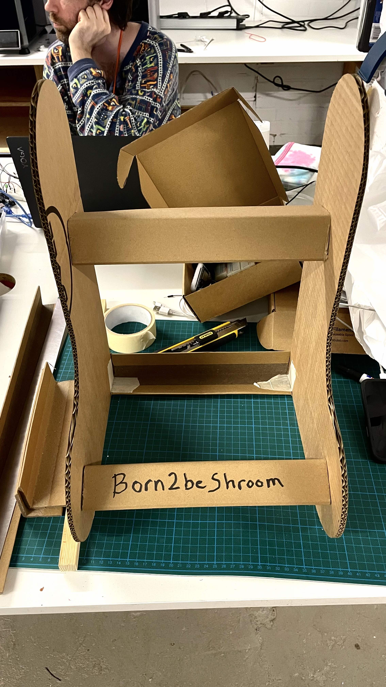
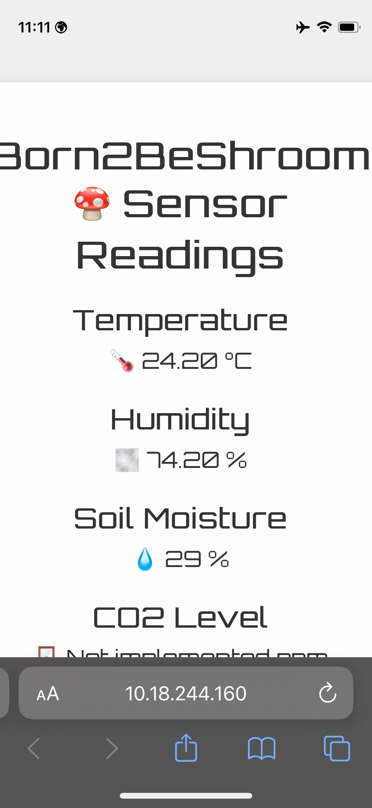

# FabLabNeukoelln-FungiProject

Why this project? 
- Get the best quality mushrooms and save money.
- can cultivate mushrooms in a small space.
- Can try to grow different types of mushrooms, even some which can be hard to get or expensive variety.
- learn about the process of growing mushrooms.
- Can be a source of extra income   
- A way to live sustainably. 
- you can make new friends and share the mushrooms with them.  
- Can reuse cardboard as substrate which can be even be a mix of cardboard and sawdust or coffee grounds. (Would need to be sterile though.)

# Where?
It is based in the basement or storage room of the NK_fablab/42Berlin school.  We just participated in the 48 hours Mackerthon and we did a prototype of a small tent with a ESP32 microcontroller and a DHT11 sensor for the humidity and temperature. We also have a small humidifier printing in progress and we plan to add two fans and a co2 monitor. The material of the tent needs to be sturdier for the final version. We will also need to add a led light source.

## Starting point of the project
We will start first by creating a fruiting chamber and use bags which already contain a spawned substrate.  
The bags can be bought online.  
A later step would be to make our own substrate and fill the our own bags with it adding the spawn, but this process needs sterilisation of the substrate first.

# Outline
Create a temperature, co2 and humidity controlled environment to grow mushrooms.  Also called a Martha tent.

## Phases
### Build a small "Martha" tent or a smaller proof of concept one-bag environment.
- Design structure, a frame to support the shelves. 
- The idea is to make it stackable and modular.
- There will be a fabric cover with a zip. If we get the right material we should be able to saw the zip together.

### Add the sensors and microcontroller
- Add the sensors and microcontroller to the tent. We chose the ESP32 microcontroller because it has wifi and bluetooth capabilities. We can use the wifi to send the data to a server and the bluetooth to connect to a phone or tablet.
- The sensors we will use are the DHT11 for temperature and humidity and a CO2 sensor. 

### The Makerthon Neukoelln
the Makerthon gave us the opportunity to try out things:
- lasercutting the frame
- update the reading on a webserver on a local network.

## Lights
Depends on the mushroom type. LED with either red or blue frequency and timer. Some mushrooms are happy with 12 hrs a day. Fruiting is red light and spawning is blue usually.

### Ventilation
- The microcontroller will control 2 fans. One for the air intake and one for the exhaust. The exhaust fan will be connected to a filter. The intake fan could be connected to a HEPA filter to clean the air before it enters the tent.

#### Sensors
- Humidity sensor. The most common temperature and humidity sensor for Arduino is the DHT series, specifically the DHT11 or DHT22.
- CO2 - Fungi don't like high CO2 content.
- Temperature needs to be between 22-28°C for oyster mushrooms.

### Some Microcontrollers
The choice is between ESP32 and Arduino. Also the Matter protocol is an interesting option. 

## Music?
Can mushrooms make music? This is still left to see.  

### Mix the Substrate
We can skip this step at first because it requires strilisation and we cannot currently do it.
- Coffee grounds
- Wood pellets
- Big container
- Plastic mushroom growing bags to hang
- Mix the pellets with the spawn. Put in bags - 3 weeks wait at 20-24°C for oysters.
- 125 kg per sq m
- Dark environment

### Fruiting
The spawned bag will be kept in the ideal environment until it fruits and then can be harvested.  
This is the first step in our project.

## Links

There are really nice series of YouTube videos about all you need:
[DIY Mushroom Tek](https://www.youtube.com/@diy-mushroom-tek)  

My Google Sheets [link](https://docs.google.com/spreadsheets/d/12R7Wkm8Nz2zLa1NQa-oBZ-2w6hAllGzAMuuDEiKfbG0/edit?usp=sharing)  

Humidity controller [link1](https://www.printables.com/de/model/246876-331-controller-with-relays-sensor-and-hmi-for-indo)  
[link2](https://www.printables.com/de/model/598587-xy-tr01-humidity-controller-mount)  

[TU Berlin workshop projects](https://www.tu.berlin/mikrobiologie/forschung/projekte)  

[The book published by TU Berlin and others](https://library.oapen.org/handle/20.500.12657/50293)  

[Art Laboratory Berlin](https://artlaboratory-berlin.org/events/mind-the-fungi-mushroom-cultivation-courses/)  

[Ecovative](https://www.ecovative.com)  

[Instructables](https://www.instructables.com/How-to-Build-a-Martha-Grow-Tent-Mushroom-Cultivati/)  

[Mycoworks](https://www.mycoworks.com)  

[TinyBe](https://youtu.be/BaEGzgNYYMQ?si=8sh8EUKXdnpMRuvQ)  

[TU Berlin Microbiology Projects](https://www.tu.berlin/mikrobiologie/forschung/projekte/entwicklung-pilzbasierter-werkstoffe)  

[Books:](https://www.tu.berlin/mikrobiologie/forschung/projekte/entwicklung-pilzbasierter-werkstoffe)  
- Mycelium Running: How Mushrooms Can Help Save the World (2004)  
- Radical Mycology: A Treatise on Seeing & Working with Fungi (2016)  

[Mimi Ferments](https://mimiferments.com/collections/workshop)  

[3D Printed Grow Tent Upgrades: Ventilation System, Humidifier and Controller YouTube Video](https://youtu.be/dSrJ2VtUzEo?si=-SNb6Bbtx5HpGsDg)  

[Optimal Humidifier for Grow Tents - Improved Version](https://www.thingiverse.com/thing:6397535)  

[Free Workshop: Starter Guide To Mushroom Farming | GroCycle](https://youtu.be/icKeO-kyiGk?si=Ma1949mAzkJjP3xK)  

[In the Garage!!!!](https://youtu.be/_kPLXib4ksE?si=WMwSg8Z2-8_iYVFy)  

[Lights:](https://www.mushroom-corner.com/posts/mushroom-grow-lights-buyers-guide)  

[Music](https://youtu.be/-hlQHYtncww?si=jag8b0jR52WN1Ij0)  
[YouTube Live](https://www.youtube.com/live/gtoHlhcNHE8?si=Ihu3Gjd1UVpKBs5c)  

[DHT11 - YouTube](https://youtu.be/dJJAQxyryoQ?si=Di6VHg_juJ59Q_K-)  

[In Grow bags](https://learn.freshcap.com/growing/mushroom-grow-bags-the-ultimate-guide/)  
[Matter - YouTube](https://www.youtube.com/watch?v=KodQZguDyHo)  
[MATTER with arduino](https://store.arduino.cc/products/nano-matter)  
[https://www.instructables.com/PART-1-Send-Arduino-data-to-the-Web-PHP-MySQL-D3js/](https://www.instructables.com/PART-1-Send-Arduino-data-to-the-Web-PHP-MySQL-D3js/)

[DIY manual Martha tent and tech](https://drive.google.com/drive/folders/1B2OIvdmnxRqS1MRcuJaII8CSyUZvPqu5)
